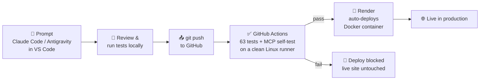

### Hi, I'm Barry 👋

**Engineer turned software developer.** I spent 30 years at Intel Ireland leading engineering teams in high-volume, tightly controlled manufacturing. Now I build AI-enabled applications and ship them to production.

- 🎓 Completing a **Higher Diploma in Software Development** at Maynooth University (2027)
- 🤖 I build with AI agents every day (Claude Code, Google Antigravity), and I build agents into my own apps
- 🔒 I care about privacy by design, testing, and software that holds up in real use
- 🔭 Currently exploring: RAG, multi-provider LLM orchestration and the Model Context Protocol
- 💼 Open to part-time work during my studies and full-time roles from June 2027

---

### ⚙️ How I build: from prompt to production in minutes

1. **Describe the change** to an AI coding agent in VS Code. It writes the code and the tests alongside it.
2. **Review it myself.** I read the diff and run the tests locally, because the agent drafts and I remain the engineer.
3. **Push to GitHub.** A CI pipeline spins up a fresh machine and runs the full test suite.
4. **Deploy only on green.** Render deploys automatically, but only after every check passes. A failing change never reaches users.

**Result:** a reviewed, tested change goes from idea to live in about two minutes, with quality gates at every step. It is the same discipline I applied to production lines at Intel: inspect at every stage, and never ship a defect downstream.

---

### 🛠️ Featured projects

**[Wall Inspector](https://github.com/BBSISK/wall_inspector)**
AI-assisted skills-assessment platform for civil engineering, heritage conservation and masonry students. Students identify defects in masonry photographs, classify severity and recommend conservation solutions, graded in real time against expert benchmarks.
`Flask` `PostgreSQL` `Docker` `Terraform` `GitHub Actions` `Gemini vision` `MCP server` `COCO / YOLOv8 export`

**[In My Time](https://www.inmytime.app)**
WhatsApp-based family-history service built on a privacy-first architecture: family stories are relayed without their content ever being stored. Client-side encryption, per-user access control, German localisation, automated API and browser test suites.
`Flask` `WhatsApp Business API` `Cloudflare R2` `Playwright` `Flask-Babel`

**[AgentMath](https://www.agentmath.app)**
Adaptive maths learning platform for Irish Junior Cycle students, with 3,000+ assessment items, teacher dashboards and personalised assignments.
`Flask` `SQLite` `JavaScript`

**[Brief](https://www.my30words.com)**
A weekly journaling app: 30-word snapshots of your life, delivered by WhatsApp and email, building a personal record of change over time.
`Flask` `Twilio` `Google & Microsoft OAuth` `PWA`

---

### 🧰 Toolbox

**Languages:** Python · Java · SQL · JavaScript · HTML/CSS
**Frameworks:** Flask · Gunicorn · Spring Boot (learning)
**Data:** PostgreSQL · SQLite · data modelling & migrations
**Cloud & DevOps:** Docker · Terraform · GitHub Actions · Render · Cloudflare · Cloudinary
**AI:** Claude Code · Gemini API · AI agents · MCP
**Integrations:** REST APIs · webhooks · Twilio / WhatsApp · OAuth (Google, Microsoft/Azure)

---

### 📫 Get in touch

📧 barry.b.sisk@gmail.com
🔗 [LinkedIn](https://www.linkedin.com/in/barry-s-50135113/)
