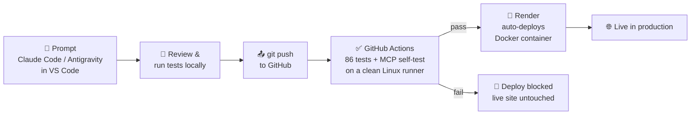

### Hi, I'm Barry 👋

**Engineer turned software developer.** I spent 30 years at Intel Ireland leading engineering teams in high-volume, tightly controlled manufacturing ([career history](career.md)). Now I build AI-enabled applications and ship them to production.

- 🎓 Completing a **Higher Diploma in Software Development** at Maynooth University (2027)
- 🤖 I build with AI agents every day (Claude Code, Google Antigravity), and I build agents into my own apps
- 🔎 **Ask me anything about my work:** [Ask Barry](https://ask-barry.onrender.com) is my retrieval-augmented generation (RAG) assistant. It answers from my public docs and cites its sources
- 🧭 **Hiring?** [Paste your job ad](https://ask-barry.onrender.com/evidence), or photograph it on your phone: an AI agent I built maps each requirement to evidence in my project docs, with links, and you can share the result by QR code, WhatsApp or email
- 📇 **Everything in one place:** [my links page](https://ask-barry.onrender.com/connect) (projects, live sites, LinkedIn, GitHub and career history)
- 🏭 **From fab to pipeline:** [how my manufacturing disciplines map onto software delivery](manufacturing-to-software.md), from SPC and change control to CI quality gates and real-time fault detection
- 🔒 I care about privacy by design, testing, and software that holds up in real use
- 💼 Open to part-time work during my studies and full-time roles from June 2027

---

### ⚙️ How I build: from prompt to production in minutes

```mermaid
flowchart LR
    A["💬 Prompt<br/>Claude Code / Antigravity<br/>in VS Code"] --> B["👀 Review &<br/>run tests locally"]
    B --> C["📤 git push<br/>to GitHub"]
    C --> D["✅ GitHub Actions<br/>86 tests + MCP self-test<br/>on a clean Linux runner"]
    D -- pass --> E["🚀 Render<br/>auto-deploys<br/>Docker container"]
    D -- fail --> F["🛑 Deploy blocked<br/>live site untouched"]
    E --> G["🌐 Live in production"]
```

1. **Describe the change** to an AI coding agent in VS Code. It writes the code and the tests alongside it.
2. **Review it myself.** I read the diff and run the tests locally, because the agent drafts and I remain the engineer.
3. **Push to GitHub.** A CI pipeline spins up a fresh machine and runs the full test suite.
4. **Deploy only on green.** Render deploys automatically, but only after every check passes. A failing change never reaches users.

**Result:** a reviewed, tested change goes from idea to live in about two minutes, with quality gates at every step. It is the same discipline I applied to production lines at Intel: inspect at every stage, and never ship a defect downstream.

---

### 🛠️ Featured projects

**[Ask Barry](https://ask-barry.onrender.com)** · [code](https://github.com/BBSISK/ask-barry)
A retrieval-augmented generation (RAG) assistant, live in production, that answers questions about my projects using only my public GitHub documentation. It cites the repo, file and section behind every answer, and says so when the docs don't support a claim.
- **Measured, not assumed:** a golden test set with trap questions, section-level retrieval metrics, and an AI judge whose quoted evidence is checked in code. I also compared Azure OpenAI, Claude and Gemini on identical evidence.
- **I tested the judge too:** I hand-labelled 55 claims, including planted near-misses with one detail changed, and measured my GPT-4.1-mini judge against a second judge of a different kind, TypeSafe's Jev decision model. They agreed on 54 of 55; Jev cost about a seventh as much and its confidence score flags the few uncertain claims for a person. The labelling also showed that I miss single changed details more often than either judge, which is the reason automated checks exist.
- **Runs itself:** a nightly GitHub Action re-indexes the docs and fails if retrieval accuracy drops. The Azure resources are managed in Terraform, and a model card documents its limits and an EU AI Act assessment.
- **Usable by other AI assistants** as an MCP tool.
- **An AI agent on top:** built with Microsoft Agent Framework, it reads a [job ad](https://ask-barry.onrender.com/evidence), calls Ask Barry over MCP once per requirement and returns an evidence map with links. Its guardrails are enforced in code: every "evidenced" row must cite a link the tool actually returned, only the one tool is allowed, runs have a budget, and it never scores or ranks a candidate. Evaluated against a no-agent baseline: no false evidence in either, and 100% vs 92% status accuracy. A skill listed only on this profile is labelled "Listed on profile", not evidenced, because a self-description isn't proof of work.
- **Built for use on the spot:** the evidence page runs the agent as a background job and shows each question it asks; a phone camera can scan a printed job ad (the text is shown for checking before anything runs); results can be shared by QR code, WhatsApp or email through a signed link, with no database.

`Azure AI Search` `Azure OpenAI` `RAG` `Embeddings` `LLM evaluation` `Terraform` `GitHub Actions` `MCP server` `Microsoft Agent Framework` `AI agents` `LLM-as-judge` `TypeSafe Jev` `Vision (text from photos)`

**[Wall Inspector](https://github.com/BBSISK/wall_inspector)**
AI-assisted skills-assessment platform for civil engineering, heritage conservation and masonry students. Students identify defects in masonry photographs, classify severity and recommend conservation solutions, graded in real time against expert benchmarks.
`Flask` `PostgreSQL` `Docker` `Terraform` `GitHub Actions` `Gemini vision` `Human-in-the-loop AI` `MCP server` `COCO / YOLOv8 export`

**[In My Time](https://www.inmytime.app)**
WhatsApp-based family-history service built on a privacy-first architecture: family stories are relayed without their content ever being stored. Client-side encryption, per-user access control, German localisation, automated API and browser test suites.
`Flask` `WhatsApp Business API` `Cloudflare R2` `Playwright` `Flask-Babel`

**[AgentMath](https://www.agentmath.app)**
Adaptive maths learning platform for Irish Junior Cycle students, with 3,000+ assessment items, teacher dashboards and personalised assignments.
`Flask` `SQLite` `JavaScript`

**[Brief](https://www.my30words.com)**
A weekly journaling app: 30-word snapshots of your life, delivered by WhatsApp and email, building a personal record of change over time.
`Flask` `Twilio` `Google & Microsoft OAuth` `PWA`

---

### 🎓 Studying now: H.Dip. in Software Development, Maynooth University (2026–27)

| Semester 1 (Sept–Dec 2026) | Semester 2 (Jan–May 2027) |
|---|---|
| Structured Programming (Java) | Algorithms & Data Structures 2 |
| Algorithms & Data Structures 1 | Web Information Processing (REST, full stack) |
| Software Testing (JUnit) | Software Project (Scrum team, DevOps) |
| Databases | Work Placement Preparation |
| Mobile Application Development (React) | |
| Computer Systems | |

Year-long: Object-Oriented Programming across multiple languages. I publish coursework code here once each module has been assessed.

---

### 🧰 Toolbox

**Languages:** Java (I write it; HDip coursework) · Python · SQL · JavaScript · HTML/CSS (built with Claude Code: I specify, review, test and deploy every change)
**Frameworks:** Flask · Gunicorn · Spring Boot (learning)
**Data:** PostgreSQL · SQLite · data modelling & migrations · vector & hybrid search
**Cloud & DevOps:** Docker · Terraform · GitHub Actions · Render · Microsoft Azure · Cloudflare · Cloudinary
**AI:** RAG · Azure OpenAI · Azure AI Search · LLM evaluation (LLM-as-judge, hand-labelled agreement testing) · AI agents (Microsoft Agent Framework, tool calling, guardrails, agent evaluation) · MCP · TypeSafe Jev (Cloudflare Workers AI) · Claude Code · Claude API · Gemini API
**Integrations:** REST APIs · webhooks · Twilio / WhatsApp · OAuth (Google, Microsoft/Azure)

---

### 📫 Get in touch

📧 barry.b.sisk@gmail.com
🔗 [LinkedIn](https://www.linkedin.com/in/barry-s-50135113/)

